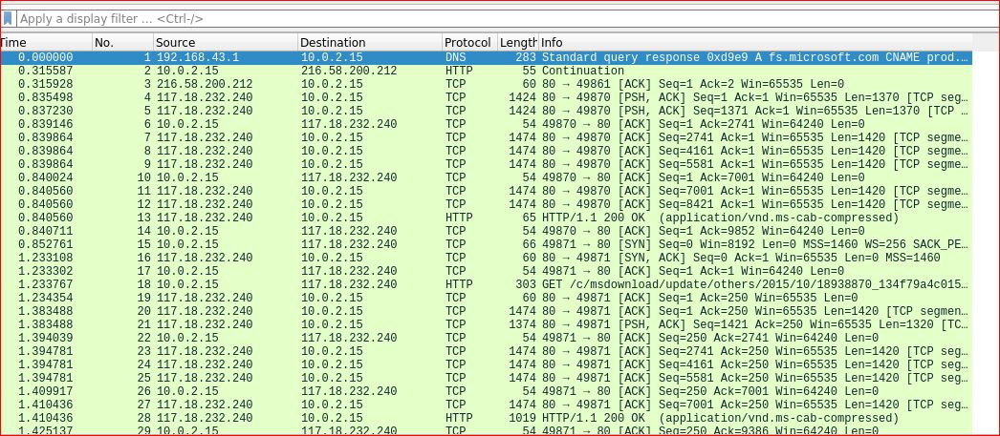
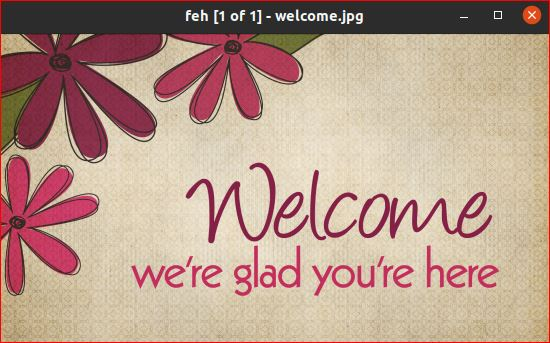

<h4>Forbidden</h4>
<pre>
## Description
Agent Troll recieved some file but not able to read the data can you help us?
Author: White_Wolf
### Hint
## Solution
</pre>

Terdapat sebuah file dengan nama file <b>trollscats.car</b>
<pre>
trollcats.car: data
</pre>
Dilakukan pengecekan dengan file ternyata sebuah data, lalu kita coba buka file tersebut || <b>cat trollscats.cat</b> berikut adalah isi file nya
<pre>
�bπ@@ �f�� 1F���L�rE8P�BZh9rE8P�BZh91AY&SY
h���z�)QI�N�E}�wXк�iV��H�
�p�@BZh9rE8P�BZh9rE8P��are_you_trying_to_use_strings�cats$�doyoulovecats2N�foryoudeer��marmar��Troll
</pre>

Disini kita diberi clue untuk menggunakan tools <b>Strings</b> ||
<b>strings trollscats.car</b> dan berikut isinya
<pre>
CAR1
BZh9
rE8P
BZh9
rE8P
BZh9
rE8P
BZh91AY&SY
@BZh9
rE8P
BZh9
rE8P
are_you_trying_to_use_strings
cats
doyoulovecats
foryoudeer
marmar
Troll
</pre>
Bisa diprediksi didalam file ini terdapat file langsung saja kita binwalk dengan command <b>binwalk -e -D=".*" trollcats.car</b> || berikut file yang terdapat ketika di  binwalk
<pre>
rwxr-xr-x 2 root root 4096 Feb 18 13:27 .
drwxr-xr-x 4 root root 4096 Feb 18 15:34 ..
-rw------- 1 root root   35 Feb 18 13:27 32 32: ASCII text
</pre>

dapat dilihat terdapat file 32 ASCII lalu kita buka dan ternyata file tersebut adalah flag
<pre>
Trollcat{M0zilla_Archive_maaaarls}
</pre>
 

<h4>the_sus_agent</h4>
<pre>
one of our agent is doing something suspicious on the network can you find out?
[file]
(https://mega.nz/file/DxUmUToR#ckGf6JffCW2M7TixQzcfQNx9Ki-66gXyNSA4lUX5Ooc)
Hint: If you got a string it's useful somewhere but it's not a flag
Author : white_wolf
</pre>

Pertama kita download file yang berada di link 
<pre>
sus_agent.pcapng: pcapng capture file - version 1.0
</pre>
Dari sini diketahui ini adalah file pcappng, dapat dibuka dengan <b>wireshark</b>

Lalu export file ini dengan http dan berikut isi file tersebut || (kurang lebih seperti ini karna ada beberapa yang tidak di copy )
<pre>
18939321_3b4f7d22a84d3e73368ae94ebb39f7ac9b15106c.cab: Microsoft Cabinet archive data, single, 9537 bytes, 1 file, at 0x1830 +A "18939321.txt", flags 0x4, number 1, extra bytes 6144 in head, 1 datablock, 0x1503 compression
18939364_c6d0d0e223ce36300abfd35228ef28c760974865.cab: Microsoft Cabinet archive data, single, 9635 bytes, 1 file, at 0x1830 +A "18939364.txt", flags 0x4, number 1, extra bytes 6144 in head, 1 datablock, 0x1503 compression
18939371_add5caef29f22cce87418993ecd707f0cb023557.cab: Microsoft Cabinet archive data, single, 8865 bytes, 1 file, at 0x1830 +A "18939371.txt", flags 0x4, number 1, extra bytes 6144 in head, 1 datablock, 0x1503 compression
25096257_a406608a078b75e3c7f9ce45495e2dceb0ce36c5.cab: Microsoft Cabinet archive data, single, 10161 bytes, 1 file, at 0x1830 +A "25096257.txt", flags 0x4, number 1, extra bytes 6144 in head, 17 datablocks, 0x1503 compression
25096258_082ee6d153456ccb326ae2f78772dec1c79f11f6.cab: Microsoft Cabinet archive data, single, 7839 bytes, 1 file, at 0x1830 +A "25096258.txt", flags 0x4, number 1, extra bytes 6144 in head, 1 datablock, 0x1503 compression
25476330_1fe4fa9c35a7d9da91c9ab93dc2ada6cac4b6bf2.cab: Microsoft Cabinet archive data, single, 11813 bytes, 1 file, at 0x1830 +A "25476330.txt", flags 0x4, number 1, extra bytes 6144 in head, 12 datablocks, 0x1503 compression
26752310_9d819a1cc3d57c8cd02d5c9b80e90526ef56567c.cab: Microsoft Cabinet archive data, single, 8049 bytes, 1 file, at 0x1830 +A "26752310.txt", flags 0x4, number 1, extra bytes 6144 in head, 1 datablock, 0x1503 compression
%2f:                                                   data
%2f(2):                                                JSON data
%2f(4):                                                ASCII text, with CRLF, LF line terminators
%2f(6):                                                JSON data
favicon.ico:                                           MS Windows icon resource - 1 icon, 16x16, 32 bits/pixel
loading.gif:                                           GIF image data, version 89a, 128 x 128
object13.application%2fvnd.ms-cab-compressed:          Microsoft Cabinet archive data, single, 9495 bytes, 1 file, at 0x1830 +A "18938904.txt", flags 0x4, number 1, extra bytes 6144 in head, 1 datablock, 0x1503 compression
secret.jpg:                                            ASCII text
welcome.jpg:                                           JPEG image data, Exif standard: [TIFF image data, big-endian, direntries=0], baseline, precision 8, 550x309, components 3
welcome.jpg.80x80.png:                                 PNG image data, 80 x 45, 8-bit/color RGB, non-interlaced
</pre>
Setelah memperhatikan isi file diatas terutama pada bagian bawa saya membuka file secret.jpg ternyata file ini adalah ascii, dengan extensi JPG palsu
<pre>
secret.jpg: ASCII text
------isifile----------
aWhvcGV5b3VkaWRub3R0cmllZHRvYnJ1dGVmb3JjZWl0
-------decodebase6s4----
echo "aWhvcGV5b3VkaWRub3R0cmllZHRvYnJ1dGVmb3JjZWl0" |base64 -d
output : ihopeyoudidnottriedtobruteforceit
------------------------
</pre>
setelah berkelit kelit dari sini dapat dipahami dengan nama file secret yang berarti password dan ascii setelah di decode kemungkinan ini adalah password yang didapat digunakan di extract

Setelah bakar menyan lebih dalam ternyata tidak ada file zip atau kompress maka dari itu hanya terdapat file welcome.jpg yang dibuka sebagai berikut

Dengan begitu gunakan steghide sebagai berikut
<pre>
steghide extract -sf welcome.jpg
Enter passphrase: 
wrote extracted data to "foryou".
</pre>
Maka muncul file baru yaitu foryou
<pre>
foryou: ASCII text
------------------
lalu kita buka deng denggg........
----------------------------------
Trollcat{this_challenge_was_easy_right???}
</pre>
V2 nya next chapter ngab mau lanjut CTFAN DULS

